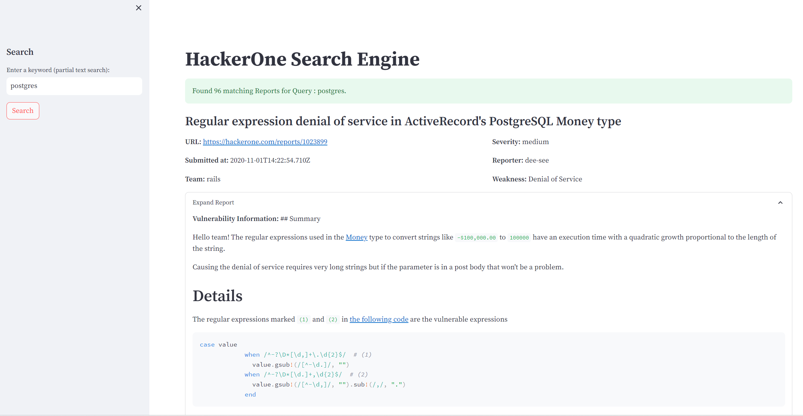

# Hackerone Reports Downloader
- Downloads JSON reports from Hackerone and saves them to a folder.
- Relies upon `https://github.com/reddelexc/hackerone-reports/blob/master/data.csv` to get report ids

## Usage
```
Download dependencies
pip install -r requirements.txt
Run the script to download latest reports
python hackerone_reports_downloader.py

Run Search UI using streamlit
streamlit run search.py

By default search UI will run on http://localhost:8501
```

### Goal of this project
- The goal is to build a report search engine on top of the data. 
- With abilities to search & filter by bounty amount, severity, bug type, program name etc
```
Let's see if i ever get around to doing that.
```




### Tasks
- [X] Build Scraper
- [X] Download all reports
- [ ] Setup a basic web app to search through the reports (initially probably won't use a DB, it's only 300MB of reports, in memory data structures should be fine while testing)
- [ ] ......